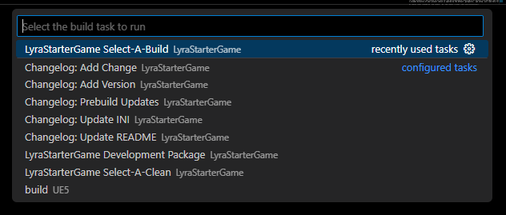

# Unreal Project Manager (UPM)

A lightweight Python module for managing Unreal projects across space, time, and platforms.

## Features

- Platform-aware generation of VS Code tasks to build, launch, cook, and package your Unreal 5+ project without having to open the editor.

    

    

- Projects can be set up for Windows, Mac, and Linux environments from a single config file with sane defaults.

- Central management of project/package versioning and patch notes.

    

- CLI for managing all build dependencies and tools.

    

    

- UPM can self-copy itself into existing repositories so there's no need to mess with submodules.

## Contents

- [Setup](#Setup)
- [Usage](#usage)
- [Also Maybe Helpful](#also-maybe-helpful)

## Setup

*TODO*

### Existing Unreal Project

*TODO*

### New Unreal Project

*TODO*

## Usage

*TODO*

## Also Maybe Helpful

